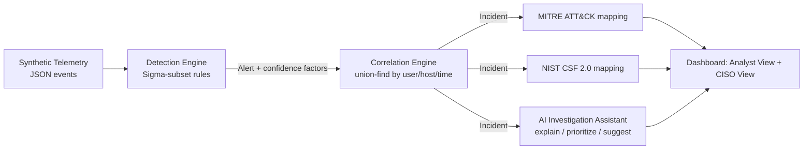

# SOC Navigator

**Turn security noise into investigations.**

SOC Navigator is an open-source, AI-assisted SOC investigation simulator. It takes raw synthetic
security telemetry, runs it through a Sigma-style detection engine, correlates the resulting
alerts into prioritized incidents, maps them to [MITRE ATT&CK](https://attack.mitre.org/matrices/enterprise/)
and [NIST CSF 2.0](https://www.nist.gov/cyberframework), and gives an AI assistant that explains,
prioritizes, and recommends next steps — without ever being the thing that decides if something
is malicious.

It exists to answer one question end to end: **how does a pile of raw events actually become an
incident an analyst can act on and a CISO can understand?**

> 143 alerts generated → 12 suspicious → 3 correlated incidents → 1 critical investigation

## Why this exists

Most portfolio security projects are a port scanner or a password cracker — offensive toy tooling
that proves you can write code, not that you understand how a SOC operates. SOC Navigator is the
opposite bet: it's built around the actual workflow a detection & response product has to support —
telemetry → detection → correlation → prioritization → investigation → executive communication —
and it's built to be run, not just read.

## Quickstart

Requires Python 3.10+. No API keys, no paid services, no external data.

```bash
git clone <this-repo>
cd soc-navigator
python3 -m venv .venv && source .venv/bin/activate
pip install -r requirements.txt
uvicorn app.main:app --reload
```

Open **http://localhost:8000**. Click a scenario in the top bar to run it (or just browse — all
five run once automatically on first load), then click into an incident to see the Analyst View,
the CISO View, and the AI Investigation Assistant.

## How it works



1. **Telemetry** — synthetic events (`app/data/telemetry/*.json`) simulate identity, endpoint,
   email, and cloud logs. No real customer or production data anywhere in this repo.
2. **Detection** — a small interpreter for a practical subset of the [Sigma](https://github.com/SigmaHQ/sigma)
   rule spec (`app/detection/sigma_engine.py`) matches rules in `detections/sigma/*.yml` against
   events and computes a confidence score from declarative increase/decrease factors.
3. **Correlation** — `app/correlation/correlator.py` clusters related alerts (same user or host,
   within a time window) into a single incident instead of showing an analyst N separate alerts
   for one attack.
4. **Mapping** — every incident is annotated with the MITRE ATT&CK techniques/tactics involved
   (`app/mapping/attack.py`) and a NIST CSF 2.0 Govern/Identify/Protect/Detect/Respond/Recover
   checklist generated from the incident's own data (`app/mapping/nist_csf.py`).
5. **AI Investigation Assistant** — `app/ai/assistant.py` explains *why* an incident is risky (or
   why it was downgraded to benign), suggests next investigation steps, and translates the
   incident into an executive summary. **The AI never decides whether something is malicious** —
   that verdict already exists before the AI runs anything. See [`docs/ai-safety.md`](docs/ai-safety.md).
6. **Dashboard** — a single-page vanilla JS/HTML frontend (no build step) serves both a **SOC
   Analyst View** (raw events, detection rule, evidence chain, confidence factors, investigation
   steps) and a **CISO View** (plain-language business-risk summary) for the same incident.

## Attack Story Mode

Five synthetic scenarios exercise the full pipeline end to end:

| Scenario | Story | Demonstrates |
|---|---|---|
| **Account Compromise → Lateral Movement** | Unusual login → encoded PowerShell → credential access → SMB pivot to a finance workstation | Multi-stage correlation, kill-chain visibility |
| **Ransomware** | Phishing click → PowerShell → credential dumping → lateral movement → mass file encryption | Full kill chain, Impact-tier urgency |
| **Credential Stuffing** | 400+ failed logins → one success from a new location → immediate privileged action | Volume-based detection, account takeover |
| **Insider Threat** | Off-hours mass download outside normal scope → upload to a personal cloud account | Behavioral/baseline deviation, exfiltration |
| **Benign False Positive** | The *same* encoded-PowerShell signature as scenario 1 — but run by IT during an approved maintenance window with a known script | Context-aware scoring, alert-fatigue reduction |

That last scenario is the point: the same raw signature produces a **critical** incident in one
context and a **reviewed, likely-benign** one in another, because the confidence score is a
function of context, not just pattern-matching. That's the whole pitch behind "reducing
operational noise."

## Detection rules

10 rules in `detections/sigma/`, each documenting its logic, MITRE technique, false-positive
causes, and the specific contextual factors that raise or lower confidence:

| Rule | Technique |
|---|---|
| Suspicious Encoded PowerShell Execution | T1059.001 |
| Credential Access via LSASS Memory | T1003.001 |
| SMB Admin Share Connection | T1021.002 |
| Authentication from a New Location | T1078 |
| Mass File Modification (Ransomware) | T1486 |
| Credential Stuffing / Brute Force | T1110.004 |
| Privileged Action After New Session | T1078.004 |
| Anomalous Mass File Download | T1530 |
| Upload to Unsanctioned Personal Cloud | T1567.002 |
| Malicious Phishing Link Clicked | T1566.002 |

See [`docs/detection-methodology.md`](docs/detection-methodology.md) for exactly what subset of
the Sigma spec this engine implements (and doesn't).

## Project structure

```
soc-navigator/
├── app/
│   ├── main.py              # FastAPI app + API routes, serves the frontend
│   ├── models.py             # Event / Alert / Incident dataclasses
│   ├── pipeline.py           # telemetry -> detection -> correlation
│   ├── store.py               # in-memory incident store
│   ├── detection/             # Sigma-subset rule engine
│   ├── correlation/           # alert clustering + risk scoring
│   ├── mapping/                # MITRE ATT&CK + NIST CSF 2.0
│   ├── ai/                      # investigation assistant
│   └── data/                     # scenario registry + synthetic telemetry
├── detections/sigma/               # the 10 detection rules (YAML)
├── frontend/                        # single-page dashboard (vanilla JS, no build step)
├── docs/                              # architecture, methodology, AI safety, sales demo
└── tests/                              # detection + correlation unit tests
```

## Docs

- [`docs/architecture.md`](docs/architecture.md) — component breakdown and data flow
- [`docs/detection-methodology.md`](docs/detection-methodology.md) — the Sigma subset + confidence scoring model
- [`docs/ai-safety.md`](docs/ai-safety.md) — why the AI explains but never adjudicates
- [`docs/threat-model.md`](docs/threat-model.md) — what this project is and isn't (synthetic data only)
- [`docs/sales-demo.md`](docs/sales-demo.md) — a discovery-call-style demo script for this project

## Roadmap

- Export detections to Splunk/Sentinel/Elastic query syntax (Sigma's actual multi-backend value)
- [Atomic Red Team](https://github.com/redcanaryco/atomic-red-team)-based validation: run authorized
  atomic tests in a lab VM and confirm the rules in `detections/sigma/` actually fire, instead of
  only validating against synthetic JSON
- Additional scenarios (compromised M365 mailbox + inbox-rule persistence, supply-chain alert)
- Real SIEM/EDR ingestion adapter (currently synthetic JSON telemetry only)

## License

MIT — see [LICENSE](LICENSE). All telemetry is synthetic; no real organizational, customer, or
production data is used anywhere in this repository.
